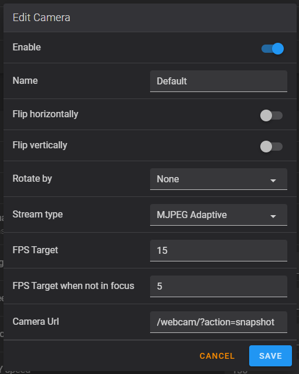

# Cameras

{: .no_toc }

---

Fluidd (and FluiddPI) have built-in support for web cameras.

On older versions of FluiddPI (1.14 and earlier) you can edit the file found at
`/boot/fluiddpi.txt`.

With FluiddPI 1.15 and later, you may configure your cameras from the same
place as your other configuration files. The file to edit is the `webcam.txt`
file.

In both cases, instructions are contained within the files.

You can add up to four cameras to display on your dashboard.

Currently supported types are;

- MJPEG Stream
  This is the traditional mjpegstream service. The service pushes images to
  fluidd at the configured resolution and FPS you have setup. This requires
  a lot of bandwidth, and can cause issues with unstable network connections.

- MJPEG Adaptive
  This will PULL images from the mjpegstream service, using the snapshot URL.
  You can set a target FPS, and your browser will try to keep up with the
  intended target. This can be a more reliable approach for some.

- IP Camera
  This is an experimental option. Effectively, it swaps out the `` tag
  for a `<video>` tag. You should only use this if you can provide a URL
  that supports native HTML5 video tags.

A note about Raspberry Pi cameras that use the MIPI CSI Camera Port: if you are using the Pi camera, and want to make changes to the default settings, you may need to uncomment and set `camera="raspi"` instead of `auto`. Otherwise, it might detect it as a USB camera and apply the settings for the USB camera. This link outlines some of the changes you can make to it: <https://community.octoprint.org/t/available-mjpg-streamer-configuration-options/1106>

Once you have configured `webcam.txt`, head on over to the UI Settings page to define your cameras.

