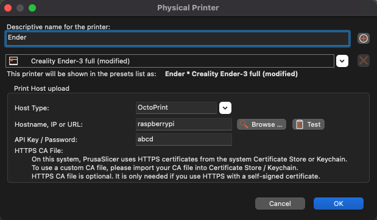

# Slicer Uploads

You can upload your sliced `gcode` from within PrusaSlicer or SuperSlicer. 

- With PrusaSlicer / SuperSlicer open, click the "cog" icon right of the Printer profiles combo box and select `Add physical printer`
- Type a descriptive printer name
- chose proper printer preset
- Ensure the type is set to `OctoPrint`
- The `hostname, IP or URL` is your printer URL. Typically this would be `fluidd.local` or similar.
- Enter some random characters in the API field.
- Click test!

