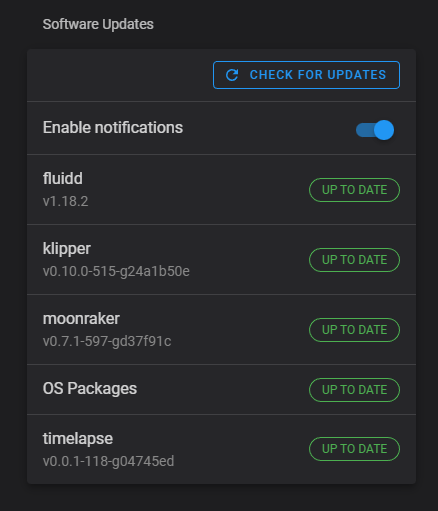

# Automated Updates
{: .no_toc }

---

Fluidd allows you to update all of its components, including the host system in an automated way.
It will notify you of available updates - and provide buttons to upgrade each individual component.

In order for this feature to be enabled, you need to configure moonraker's update plugin.

Please see here for the [moonraker configuration](/configuration/moonraker_conf) docs.

